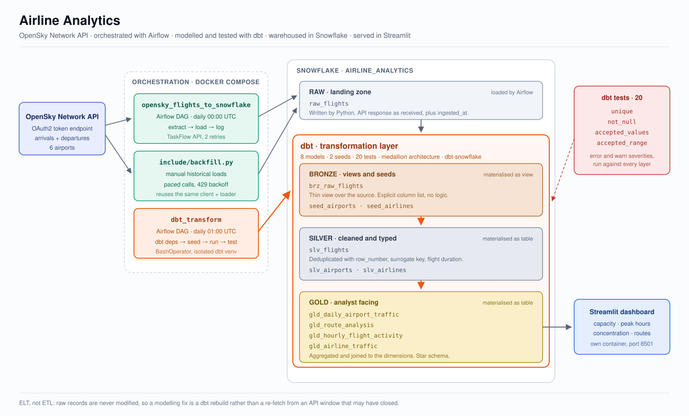
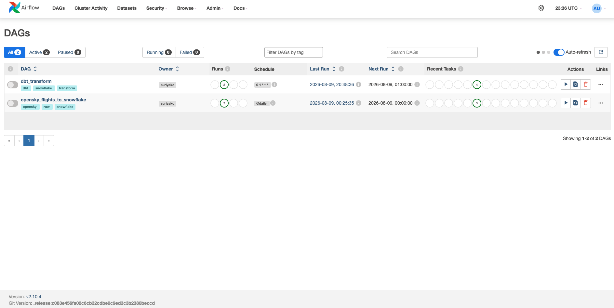
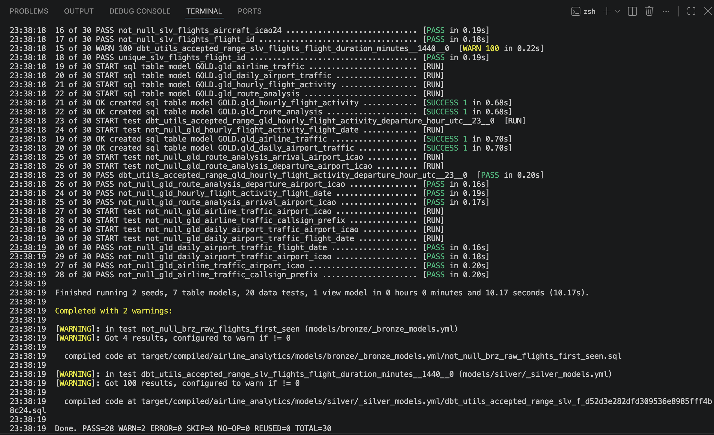
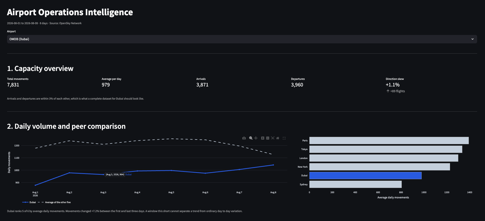
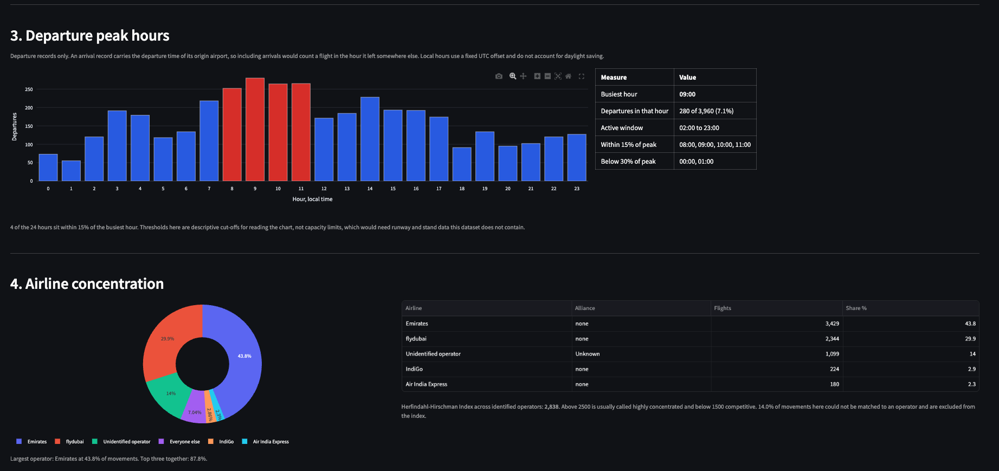
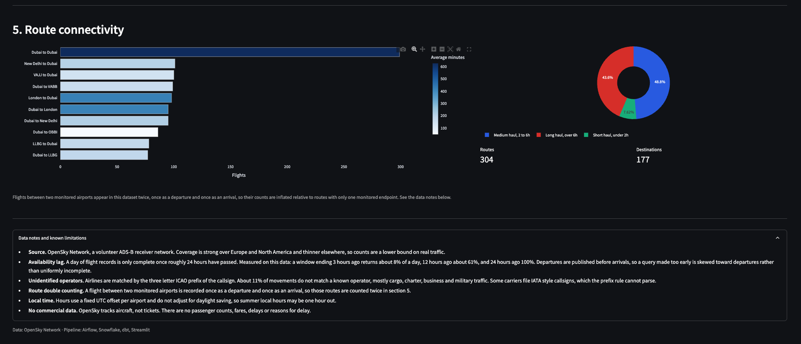

# Airline Analytics

A daily data pipeline that pulls flight movements from the OpenSky Network API, loads them into Snowflake, transforms them with dbt, and serves the results in a Streamlit dashboard.

I built this project to practise the parts of analytics engineering that don't really show up in a SQL exercise: orchestration, data quality, data modelling, and dealing with a real API that doesn't always behave the way you'd expect.



## What it does

The pipeline collects arrivals and departures for six airports:

* New York JFK
* London Heathrow
* Paris Charles de Gaulle
* Tokyo Haneda
* Dubai
* Sydney

There are two Airflow DAGs:

* `opensky_flights_to_snowflake` runs at midnight UTC and loads the raw API response.
* `dbt_transform` runs an hour later and builds the dbt models and tests.

The idea is to keep ingestion and transformation separate. Raw data lands first, then dbt handles everything downstream.



## Stack

| Tool               | What it does                                            |
| ------------------ | ------------------------------------------------------- |
| Docker Compose     | Runs the local Airflow, Postgres and Streamlit services |
| Apache Airflow     | Schedules ingestion and transformation                  |
| Snowflake          | Stores the data across the different layers             |
| dbt                | Handles transformation, testing and documentation       |
| Streamlit + Plotly | Serves the dashboard                                    |
| GitHub Actions     | Validates the dbt project on every pull request         |

## Data model

| Layer  | Materialised as | What happens                                                             |
| ------ | --------------- | ------------------------------------------------------------------------ |
| RAW    | Table           | Stores the API response with an `ingested_at` timestamp                  |
| BRONZE | View            | Basic column selection                                                   |
| SILVER | Tables, `slv_flights` incremental        | Deduplication, renaming, type casting, surrogate key and flight duration |
| GOLD   | Tables          | Daily airport traffic, routes, hourly activity and airline traffic       |

Raw data is loaded before any cleaning or transformation. If I get something wrong in the modelling, I can fix the SQL and rebuild from the raw layer instead of having to call the API again.

`slv_flights` is incremental and merges on the surrogate key, so a re-run only
processes batches at or after the newest one already in the table.

There are two different duplicate problems here and they need two different
mechanisms. The window function removes duplicates inside a single batch. The
merge handles the same flight turning up again in a later batch, where the
window function can't see the earlier copy. Re-running the model processes rows
without changing the row count.

There are currently **8 dbt models and 20 tests**.

The tests cover things like:

* uniqueness of the flight surrogate key
* not-null checks on identifiers and timestamps
* accepted values for flight direction
* reasonable ranges for flight duration

A GitHub Actions workflow runs `dbt deps` and `dbt parse` on every pull request.
It doesn't connect to Snowflake, so it catches broken refs, Jinja errors and
malformed YAML without needing credentials or a running warehouse. That also
means it keeps working after my Snowflake trial expires.



## Running it

You need Docker Desktop, a Snowflake account and OpenSky API credentials.

```bash
git clone https://github.com/suriyakc/airline-analytics.git
cd airline-analytics
cp .env.example .env
# add your credentials to .env

docker compose up -d
```

Airflow runs at http://localhost:8080 and the dashboard runs at http://localhost:8501.

To load historical data instead of waiting for the daily schedule:

```bash
docker compose exec airflow-webserver python -m include.backfill
```

## The dashboard

One page with five sections: capacity, daily volume against peer airports, departure peak hours, airline concentration, and route connectivity. It reads only from the gold layer.





## What I found while building it

### OpenSky data doesn't arrive evenly

This was probably the most useful thing I found while building the pipeline.

At first I was getting very few flights when querying the previous 24 hours. I assumed something was wrong with my ingestion, so I ran the same 24-hour query several times and moved the end time further backwards.

For Heathrow arrivals I got:

| Window ends  | Flights returned | Share of a full day |
| ------------ | ---------------: | ------------------: |
| 3 hours ago  |               50 |                  8% |
| 6 hours ago  |              168 |                 25% |
| 12 hours ago |              400 |                 60% |
| 18 hours ago |              633 |                 96% |
| 24 hours ago |              662 |                100% |

The problem wasn't just that the data was incomplete. It was also biased.

When I triggered the DAG manually for a day that had only just finished, four of the six airports returned zero arrivals but still had a few hundred departures.

That makes sense once you look at how the data is recorded. A departure can be confirmed as soon as the aircraft leaves. An arrival needs the flight to finish and be matched back to an airport.

So a dataset can look like it contains plenty of data while still being badly biased towards departures.

For this project, that means the timing of the ingestion matters just as much as whether the API request succeeded.

### Sydney is quieter on Saturdays

The two Saturdays in the data had noticeably fewer movements at Sydney:

* Saturday 1: **629 movements**
* Saturday 2: **635 movements**
* Weekdays: roughly **817–901 movements**

That's around 25% lower than the weekdays in this small sample.

The other five airports didn't show the same pattern.

Two Saturdays obviously aren't enough to call this a real seasonal pattern, so I'd want several more weeks of data before drawing a conclusion. Still, the fact that both Saturdays were very similar made it worth investigating.

### Airline matching needed more work than expected

I originally matched airlines using the first three characters of the flight callsign.

The first version left **27.1% of movements without an airline match**.

Rather than just accepting that number, I looked at the unmatched ICAO prefixes, ranked them by volume and added the nineteen prefixes that accounted for most of the missing matches to the seed file.

That brought the unmatched percentage down to **10.9%**.

The remaining records include cargo, charter, business and military traffic, so I wouldn't expect every movement to have a commercial airline match.

I also found one interesting edge case.

Aeromexico uses IATA-style callsigns such as `AM2345`. Taking the first three characters gives `AM2`, which isn't an airline ICAO code.

I left those records unmatched rather than creating an incorrect mapping just to make the join look better.

## Problems I ran into

### OpenSky timed out from GitHub Codespaces

Every request to the OpenSky token endpoint was hanging and eventually timing out from GitHub Codespaces.

Other internet access from the Codespace was working, so initially this was confusing. I also found an online "is it down?" checker reporting that OpenSky was unavailable, but that turned out not to be useful because those services are also running from cloud infrastructure.

The useful clue was the type of failure.

A credentials problem would fail fast with a `401`. A timeout while connecting to port 443 pointed towards a network path problem instead.

I eventually found that OpenSky filters traffic from some hyperscaler IP ranges, while GitHub Codespaces runs on Azure.

I moved the Docker stack onto my own machine and the exact same request worked immediately.

That was a good reminder that an API being reachable from my laptop doesn't necessarily mean it will be reachable from a cloud environment.

### The backfill hit a rate limit

My first backfill version made twelve API calls per day with no delay.

It worked for a while and then failed with a `429` on the 95th call out of 96.

I added a two-second gap between calls and retry logic with a backoff when a `429` is returned.

### Tokens expire during a backfill

OpenSky access tokens last five minutes.

A backfill across several days can take longer than that, so getting one token at the beginning of the entire run wasn't reliable.

The backfill now requests a fresh token at the start of each day.

### Deduplication finally got tested properly

I re-fetched some days that were already in Snowflake and ended up creating **6,331 duplicate raw records**.

That gave me a much better test of the silver model.

The silver layer uses a window function to deduplicate using the aircraft, both timestamps and flight direction. The uniqueness test on the resulting surrogate key then passed.

Before deliberately re-fetching the data, the uniqueness test was passing simply because the raw data didn't contain duplicates.

The test was green, but it hadn't really proved much.

## Known limitations

I'd rather document these than pretend the pipeline is more complete than it is.

* **Route counts can be inflated for some pairs.** A flight between two monitored airports appears twice: once as a departure and once as an arrival. A route with only one monitored endpoint appears once. The fix would be a distinct count using aircraft plus both timestamps in `gld_route_analysis`.
* **Local hours don't currently account for daylight saving.** The airport seed uses a fixed UTC offset, so summer local times can be an hour out. Snowflake's `convert_timezone` with a proper timezone column would fix this.
* **Peak-hour analysis uses departures only.** Arrival records contain the departure time from the origin airport, so including them would count a flight against the hour it left somewhere else.
* **Scheduling currently depends on my laptop.** Airflow only runs while the Docker containers are running. A production version would need an always-on environment.
* **There is no commercial flight data.** OpenSky tracks aircraft movements, not passengers or tickets, so there are no passenger numbers, fares or delay reasons.

## Repo structure

```text
dags/          Airflow DAGs
include/       API client, Snowflake loader and backfill script
dbt/           dbt project: models, seeds, macros and tests
streamlit/     Dashboard and its image
docs/          Screenshots and architecture diagram
.github/       GitHub Actions CI workflow
```

I kept the API and Snowflake loading logic in `include/` rather than putting everything directly inside the DAG files.

That means the logic can be tested and reused independently of Airflow.

The backfill script also imports the same API and loader modules used by the daily pipeline, so there isn't a second copy of the ingestion logic to maintain.

## What I'd do next

* Fix the route double count in `gld_route_analysis`
* Add `flight_date` to the airline and route models so the dashboard can filter by date range
* Move the local time conversion onto Snowflake's `convert_timezone`
* Extend CI to run `dbt build` against a dedicated Snowflake CI schema
* Send a Slack alert when a dbt test fails

## Current data

At the time of writing:

* **62,607 rows** in RAW
* **56,276 rows** in SILVER
* Data covering **1–8 August 2026**

This is still a portfolio project rather than a production pipeline, but the goal was to build something where the engineering problems were real enough that I had to investigate them rather than just make the happy path work.